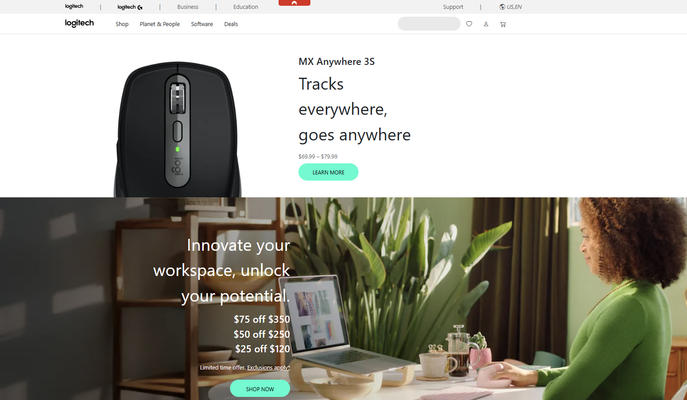

User interface (UI) frameworks have become staples in contemporary front-end web development. They often rival the complexity of a new programming language, demanding significant effort to master. Many might wonder why developers bother with frameworks like Bootstrap 5, Semantic UI, or others, rather than simply coding their pages from scratch with raw HTML and CSS. The reasons lie in the benefits these frameworks offer in terms of streamlined development, consistency, responsiveness, and maintainability.

One of the most compelling benefits of using frameworks like Bootstrap is the speed at which you can transform a design concept into a functional web page. UI frameworks come bundled with reusable components (navigation bars, modals, carousels, buttons, grids, etc.) that are easily styled and quickly assembled. Instead of manually recreating these features from scratch, developers can rely on standardized, pre-tested elements.

Consistency is a major advantage in large projects or teams, where many developers work on different parts of the same site. By using the same framework, the team can maintain uniform styling, ensuring a cohesive user experience that might be more difficult to achieve with custom CSS alone.

Modern UI frameworks, especially Bootstrap, prioritize mobile-first design. They offer responsive grid systems and breakpoints that adapt seamlessly to different screen sizes. Building a responsive layout from the ground up can be time-consuming and error-prone. Frameworks handle most of the heavy lifting, letting you focus on refining the user experience, content, and brand identity rather than debugging layout issues across devices.

In my experiences with using the Bootstrap framework, when recreating Logitech’s homepage, I ran into a lot of issues with getting the fonts to be exactly as how I wanted them to be. Bootstrap provides a selection of font sizes to choose from with their fs classes. Including the class fs-1 would allow the font to appear quite big. These function similarly to how headings work in that they were preset sizes. However, I found this limiting whenever I wanted to fine tune the font sizes to the exact size I wanted. Ultimately, I had to resort back to operating in CSS to tweak the font size.

Perhaps, the aforementioned issue I ran into may have come from a lack of mastery with Bootstrap, or perhaps it is a nuance only specific to the Bootstrap framework. I believe that had I been more skilled at web design, I would have approached recreating the website another way.
