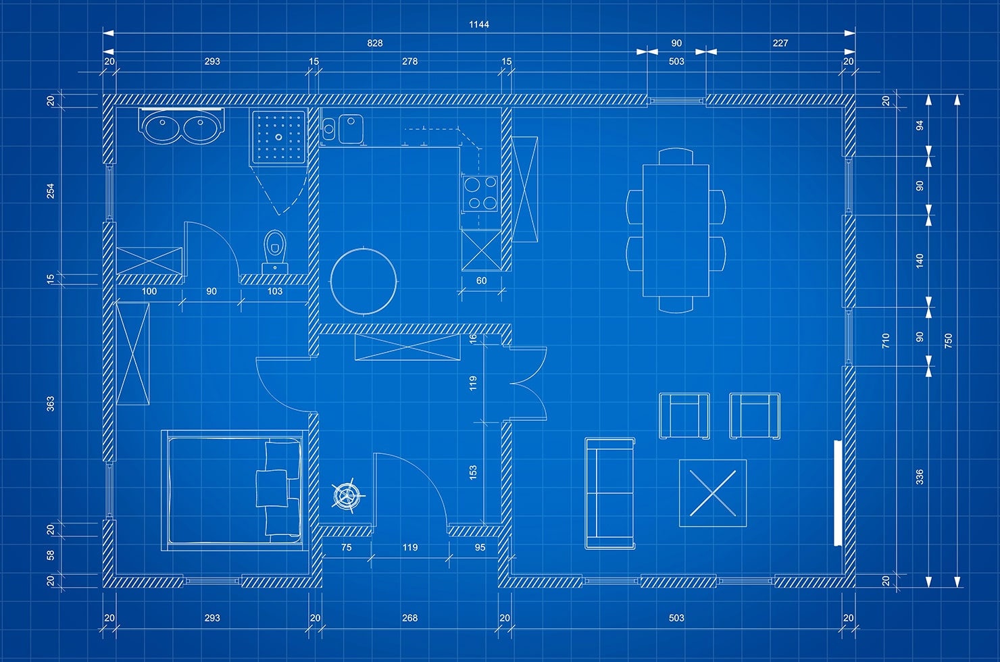

## When time predictions meet reality

Estimating effort in software development sometimes feels like reading tea leaves: everyone knows the future is hazy, yet we keep peering in anyway because it beats stumbling in the dark. At the start of each milestone, our team would meet together to discuss what needs to be done by the next deadline. At the end of our meeting, we would gaze at a fresh backlog item—perhaps a new feature or an elusive bug fix—and someone would blurt out, “That should only take three hours, max.” We would all nodded, fully aware it might balloon into a multi-day adventure. Even knowing our forecasts could be hilariously off, we still believed in the value of pinning a number on each task. That single estimate sparked conversations about scope, hidden risks, and who actually had the bandwidth to tackle it. Without the number, we would have been guessing blind.

## Estimates (or more apt to say, "mistakes") were made

In the estimation, our numbers came from three places: past experience, gut instinct, and quick “sanity checks". If a similar workout-of-the-day once took two hours, we wrote down “around two hours” for the new ticket. When we ventured into brand-new territory, we tossed around rough figures until they felt reasonable—then added a little buffer for the inevitable curveballs. Before committing, someone would usually ask, “Three hours feels fair, right, or are we kidding ourselves?” Those five-minute reality checks saved us from epic underestimates more than once. Still, spoiler alert: early guesses were almost always wrong—but hashing them out ahead of time consistently paid dividends.

Being wrong turned out to be educational. Each surprise overrun forced us to outline tasks before writing code, revealing hidden to-dos such as database migrations that quietly double the workload. Missteps also sharpened our priorities: we knocked out tiny issues first, while big unknowns triggered pair programming or a quick spike to explore the problem space. As the weeks rolled by, as we got more used to time-tracking, our time estimations became more in line. Once we were in the flow of the project and got better at our software development skills, there were fewer times in which we ran into fewer bugs that would balloon the time taken on an issue. Of the times we did run into bugs, they were anticipated and accounted for in our time estimation.

## Time tracking with tools

To ground our hunches in reality, we tracked time relentlessly. WakaTime captured every keystroke in VS Code, Code Time summarized daily activity, and a humble stopwatch covered quick, non-IDE moments. Altogether we logged roughly most of our working hours—enough to turn feelings into facts, seeing an allegedly “easy” ticket bloat from 90 minutes to five hours grabbed everyone’s attention, prompting us to revise estimates and redistribute workload the very next milestone. Empirical data transformed vague impressions like “that was a lot of work” into hard evidence we could act on.

The only real downside was psychological: time tracking can feel like a scoreboard. Spending six hours on a task slated for two can sting, even when the final result works perfectly. Once we decoupled effort from failure and reframed the overrun as feedback, the numbers became coaching cues rather than judgment. Administrative overhead was trivial—automated trackers ran silently, and starting or stopping a manual timer cost mere seconds—so the benefits easily outweighed the annoyances.

## The benefits

Ultimately, estimation and tracking turned raw activity into shared insight. Clearer plans emerged, mid-week surprises declined, and task splits grew fairer: when someone’s tracker showed nonstop thrashing in a tricky module, we could throw them a lifeline or a fresh pair of eyes. Perhaps more importantly, the ritual of guessing, measuring, and reflecting nudged us from a loose collection of coders toward a genuine team that learns together, adjusts on the fly, and improves with every release. We never became perfect predictors, but every milestone moved our wild guesses a step closer to reality—and that steady, collaborative evolution is precisely what good engineering looks like.
