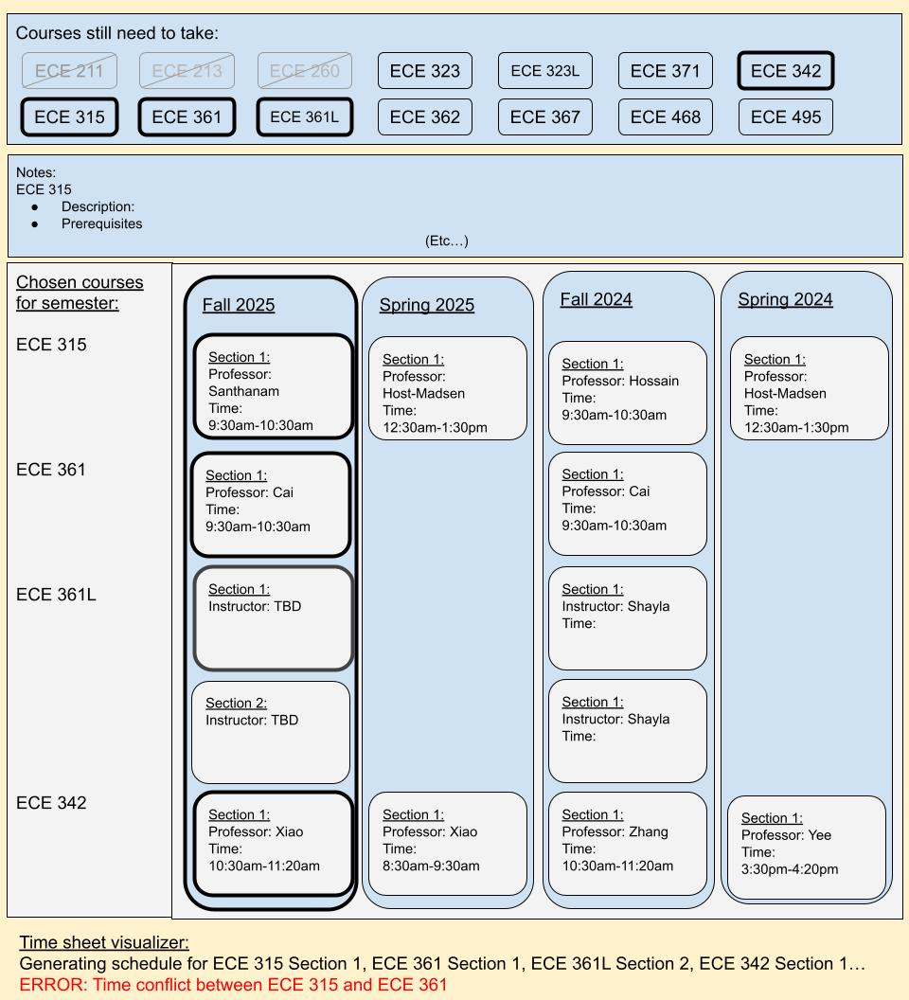

## Overview
**Problem:** Registration period is often the most anxiety inducing period of a semester. Students must make decisions that bound them for their next term, and taking the wrong classes in the wrong order can be costly and can set them back a semester or two from graduating. 

For example, computer engineering students should be aware that ECE 315 and ECE 361 are always offered in the same time of day (leading to a time conflict), but ECE 315 is offered both Fall and Spring while ECE 361 is only offered in Fall. Furthermore, ECE 361 is a major prerequisite for higher level computer engineering courses.

By examining past terms, students can make informed decisions and can plan out their schedules earlier and accordingly to the demands of their course load. However, this information is scattered across various charts and datasheets that are messy to look through and do not do a good job at displaying trends or insights. Such resources include:
- Check sheets
- Hawaii Class availability website
- Schedule of Classes Charts (emailed from ECE Department Chair)
- STAR

**Solution:** The course schedule builder consolidates all the relevant information from the above listed resources across previous semesters into a handy tool that allows students to better plan out their semesters according to the pathway they must take to graduate. Although course schedules do change throughout semesters, most core classes follow the same schedule every corresponding semester.

## Approach
Users can use this website as a supplementary tool to STAR and other registration planning resources. The user will select their major, then the courses they plan to take. The page will load information from the past few semesters about what sections have been offered, who was the instructor, etc.

The user can manually select the sections that and have the page will create a time sheet of those courses. The user can also simply generate a list of available schedules based on the courses selected.

Given a 5 week duration, a working mockup of the application on 2 years (4 semesters, excluding summer semesters) worth of data for only the Computer Engineering ECE track could be feasible.

## Names of proposers

- Elias Thompson
- Ethan Ibanez
- Gordon Sheen
- Shaylon Mizukami

## Mockup Page Ideas

- Landing page
- Choose your major track page
- Course schedule manual builder page (view available sections offered, section times, and instructor for each section)
- Course schedule generator page

*Rough UI mockup of course schedule builder*

## Use Case Ideas
- A user can generate a list of schedules based on the courses they would like to take and select the schedule that best suits them
- A freshmen student can make a mock plan of all the courses they will take throughout their time in college and avoid major time conflicts.
- A user can check to see who typically teaches a given course and if the course is only offered during a particular semester.

## Beyond the Basics
- Implement a time sheet visualization based on courses selected
- Apply logic to create generate a list of possible schedules from selected courses
