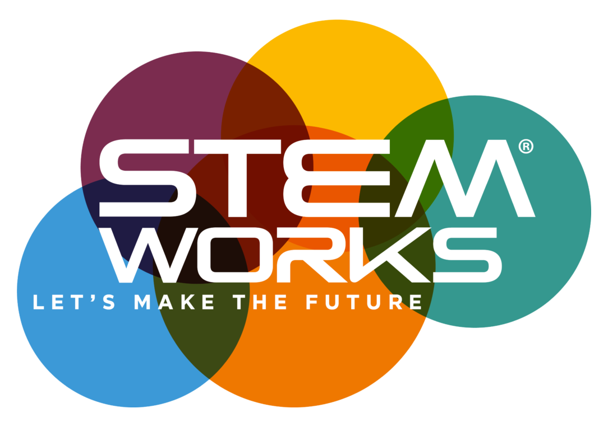
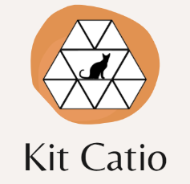

  
  

As part of an internship, I worked alongside NOAA Fisheries to turn a hackathon idea of an eco eco-friendly, modular, and cost-effective cat enclosure (a 'catio') into a full-fledged prototype along with a business pitch. My team and I organized team meetings and maintained a project log throughout the duration of the internship. I prepared and secured approval for a project budget encompassing tools and materials

Prior to this project, we designed the catio on SketchUp and pitched it during an earlier STEMWorks Hackathon. The organizers liked our design so much that gave us an opportunity to build the actual. We worked with power tools such as the chop saw and jigsaw and evaluated the features and costs of materials. The entire project and internship was student led, with only weekly meets to report our progress to the organizers.
