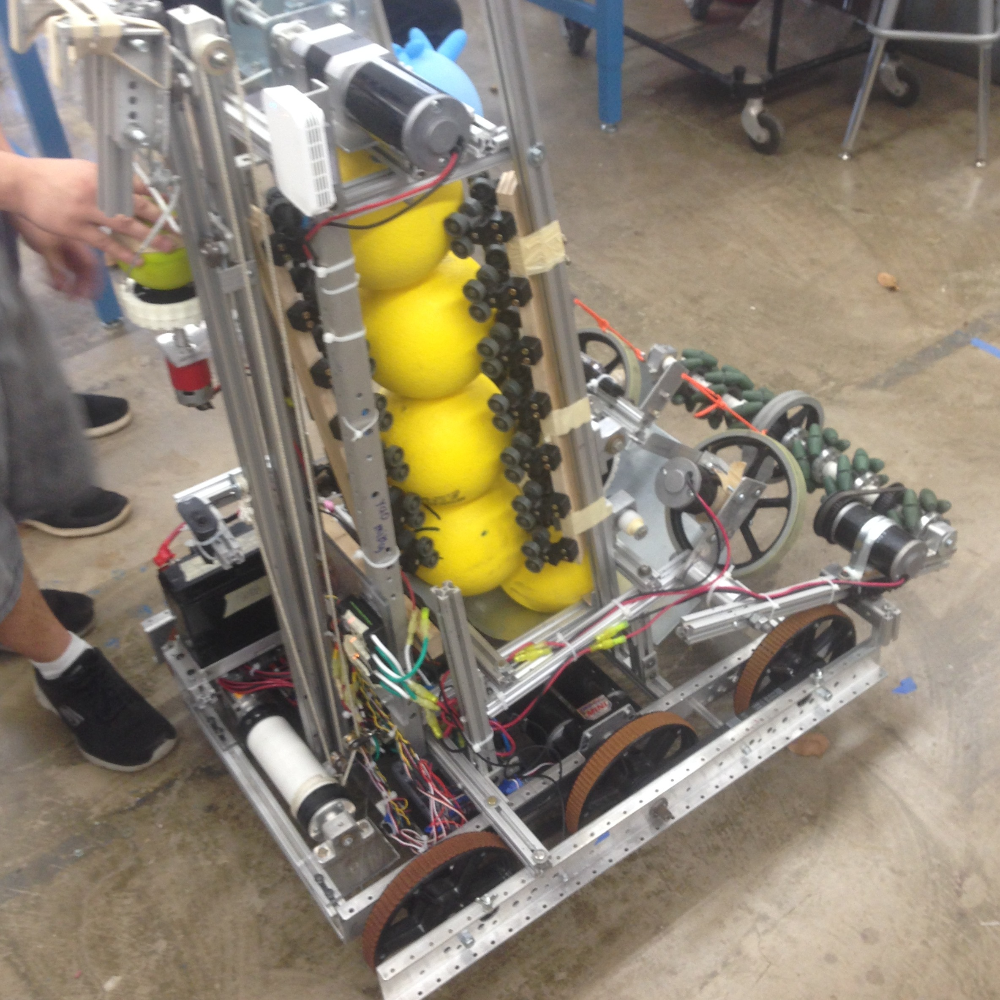

  

I was a part of Moanalua High School's robotics program for 4 years. Every spring, we would compete in the FIRST Robotics Competition (FRC) where we would put together a robot that would compete in the year's game. During my final year of high school, I was the design lead and president of the robotics club. Although my team did not win any awards or place notably in the competition, we were successful revitalizing the robotics club after a leadership transitory period during the pandemic. We did this by increasing membership and participatory rates.

After I graduated from high school, I stayed with my team as a mentor. Recently, during the 2024 FRC competition, our team won the Hawii Regional competition with help of alliance partners from Wailua High and McKinley High. We were also chosen for the Wild Card award.
